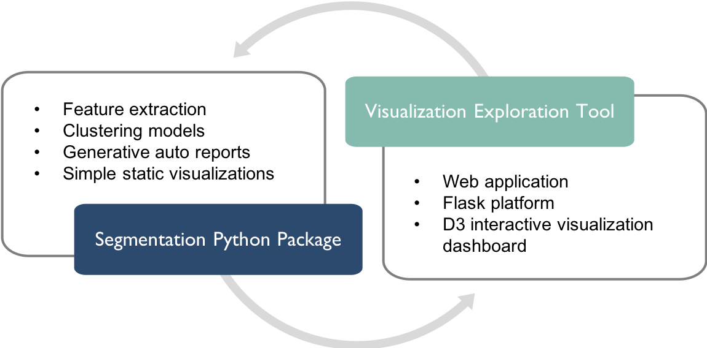

## Contents
{:.no_toc}
*  
{: toc}

## Team
Harvard 2018 Spring AC297r Capstone Project: Chia Chi (Michelle) Ho, Yijun Shen, Jiawen Tong, Anthony Hou

## Introduction

The Massachusetts Bay Transportation Authority (MBTA) is the largest public transportation agency in New England, delivering a complex system of subway, bus, commuter rail, light rail, and ferry services to riders in the dynamic economy of the Greater Boston Area. It is estimated that MBTA provides over 1.3 million trips on an average weekday. While MBTA collects a wealth of trip transaction data on a daily basis, a persistent limitation has been the organization’s lack of knowledge around rider groups and their respective ridership habits. Understanding rider segmentation in the context of pattern-of-use has significant implications in developing new policies to improve its service planning and potentially changing its fare structure.


## Project Deliverables
This repo contains code documentation for both of our deliverables:
- Python Rider Segmentation Package
- Web-based Visualization Exploration Tool

| |
|:--:|
| ***Figure 1: Project Deliverables*** |

## Full Package Structure

The high-level functionality of this rider segmentation package is to group individual MBTA riders according to pattern-of-use dimensions. Our full package has the following structure:

```sh
Rider-Segmentation-Full-App/
    MBTAdashboard/
        __init__.py
        app.py
        src/
            __init__.py
            json_generator_driver.py
            util.py
        static/
            css/
                'custom css files for D3 visualization'
            img/
                'MBTA icon images'
            js/
                'custom javascript files for D3 visualization'
            lib/
                'library files'
        templates/
                'html files'
    MBTAriderSegmentation/
        data/
            cached_clusters/
                hierarchical/
                    'hierarchical clustering .csv results and .json scores'
                non-hierarchical/
                    'non-hierarchical clustering .csv results and .json scores'
            cached_features/
                '.csv rider features by start month'
            cached_profiles/
                '.csv cluster profiles by start month'
            input/
                censue/
                    'census data'
                geojson/
                    'data to draw the maps'
            report_models/
                report_cnn.h5
        __init__.py
        config.py
        features.py
        profile.py
        report.py
        segmentation.py
        visualization.py
```

A brief description of each item in ```MBTAriderSegmentation/```:

- **`data/` directory** contains the input data files (i.e., US census data, geojson data which is used to draw maps) and output result files (i.e. extracted feature in `cached_features`, segmentation results in `cached_clusters`, profiled cluster summaries in `cached_profiles` and a trained CNN model to classify temporal patterns in `report_models`) .

- **`config.py` module** defines global constants (e.g., data path, file prefix, rider type dictionary) that are used in the other modules.

- **`feature.py` module** extracts different sets of rider-level features ([details](https://ac297r-mbta-2018.github.io/Final-Report/feature.html)) from transaction-level data and save the extracted features in the `data/cached_features/` directory.

- **`segmentation.py` module** implements the K-means and LDA clustering algorithm and save the rider features with its cluster assignment in the `data/cached_clusters/` directory.

- **`profile.py` module** aggregated the rider features by cluster assignments and generates a text summary that describes the cluster size, average number of trips, predicted rider type (by using the report.py module), weekday / weekend hours and the zip code associated with the most traffic for each cluster. The profiled clusters are saved in the `data/cached_profiles/` directory.

- **`report.py` module** is called by `profile.py` to format the generated cluster description for each cluster. The column of generated summary texts is appended to the profiled cluster data frame.

- **`visualization.py` module** implements all types of visualization graphs in python.

## Installation

- Step 1: Download code from our [github](https://github.com/AC297r-MBTA-2018/Rider-Segmentation-Full-App)
> ```
> git clone https://github.com/AC297r-MBTA-2018/Rider-Segmentation-Full-App.git
> ```

- Step 2: Obtain AFC, ODX, stops and fare product data from MBTA
> **Note**: We did not publish this data for security reasons.

- Step 3a: Run modules from MBTAriderSegmentation
> ```
> cd Rider-Segmentation-Full-App/
> python3 MBTAriderSegmentation/[]_driver.py
> ```

- Step 3b: Run dashboard
> ```
> cd Rider-Segmentation-Full-App/
> python3 MBTAdashboard/app.py
> ```
> Copy the local host link (http://0.0.0.0:5000/)
> Open a browser and paste the local host link to view the dashboard
